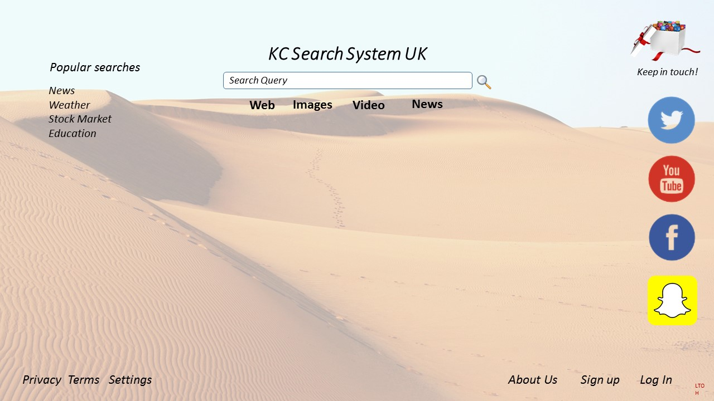

# A Study of Search User Interface Design Based on Hofstede’s Six Cultural Dimensions
Additional UI files for Chessum et al: A Study of Search User Interface Design Based on Hofstede’s Six Cultural Dimensions.

The paper _A Study of Search User Interface Design Based on Hofstede’s Six Cultural Dimensions_ by Karen Chessum, Haiming Liu and Ingo Frommholz mentions several prototype UI design examples that could not be accommodated in the paper due to space restrictions. You can view and download these designs from the UIDesignImages folder.

## Designs

Below are examples of the designs mentioned in Section 3 and 4 of the paper.

### Power Distance (PD)

UI 1 - High PD

UI 2 - Low PD

### Individualism (IDV)

UI 3 - High IDV

UI 4 - Low IDV

### Masculinity (MAS)

UI 5 - High MAS

UI 6 - Low MAS

### Uncertainty Avoidance (UA)

UI 7 - High UA

UI 8 - Low UA

### Long-term Time Orientation (LTO)
UI 9 - High LTO

UI 10 - Low LTO

### Indulgence vs Restraint (IND)
UI 11 - High IND

UI 12 - Low IND

Images used to create the UIs: Pixabay (2021). Stunning free images & royalty free stock. Available at: https://pixabay.com/
